# Sistema Asilo Vicentino

Full-stack institutional and administrative platform built for **Asilo Vicentino Nossa Senhora da Penha**, a charitable elderly care institution in Pirapozinho, SP.

The project combines a public website for community visibility with a protected internal system for the institution's daily operations.

**Live website:** [www.asilovicentino.com.br](https://www.asilovicentino.com.br)

## Screenshots

### Public Experience

  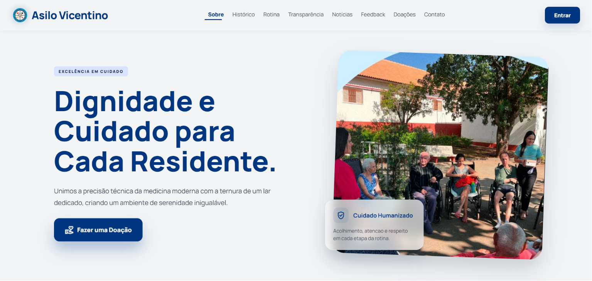
  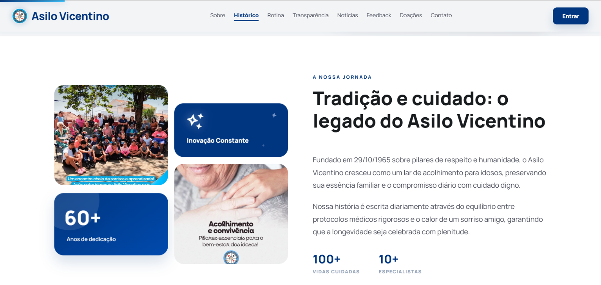

  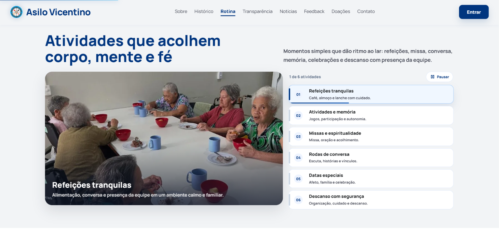
  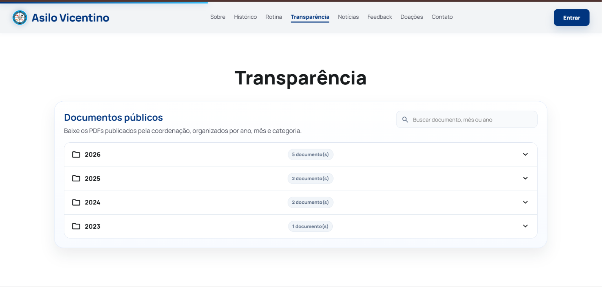

  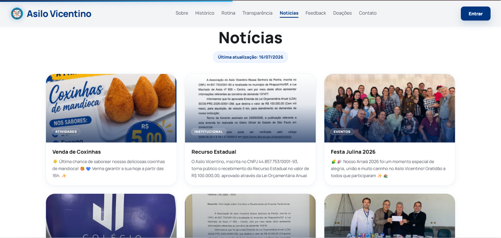
  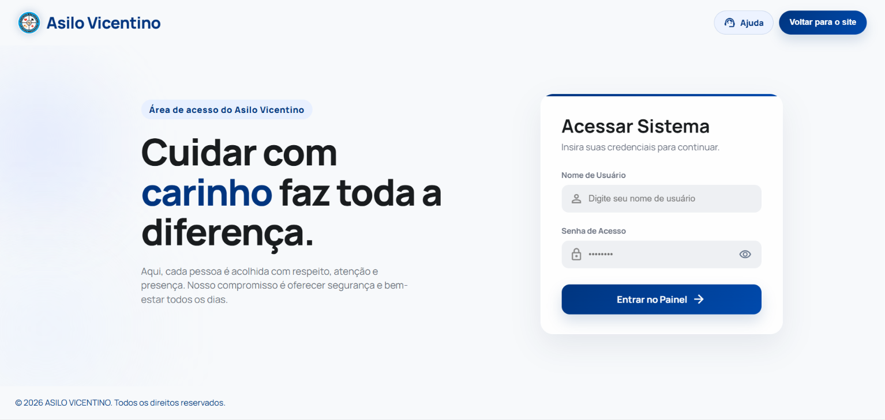

### Internal Management

  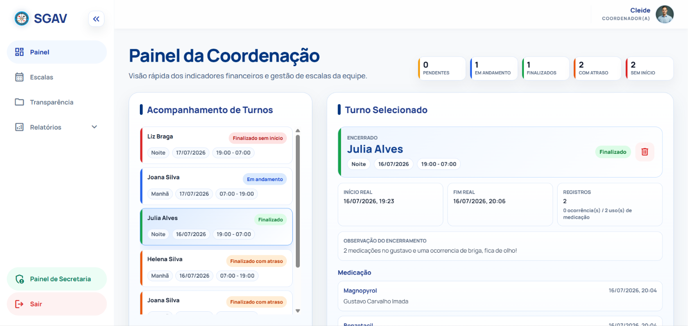
  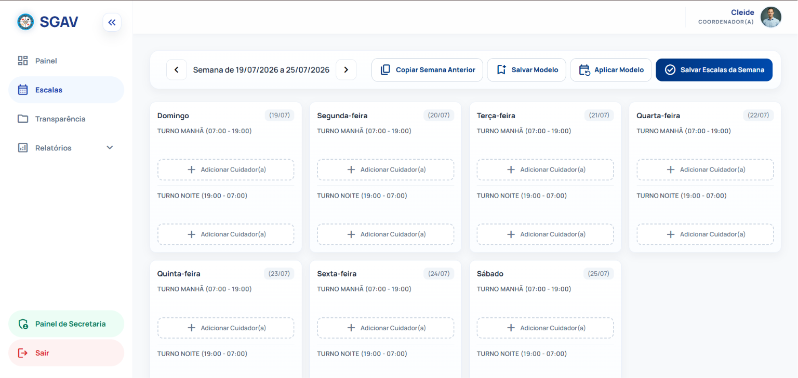

  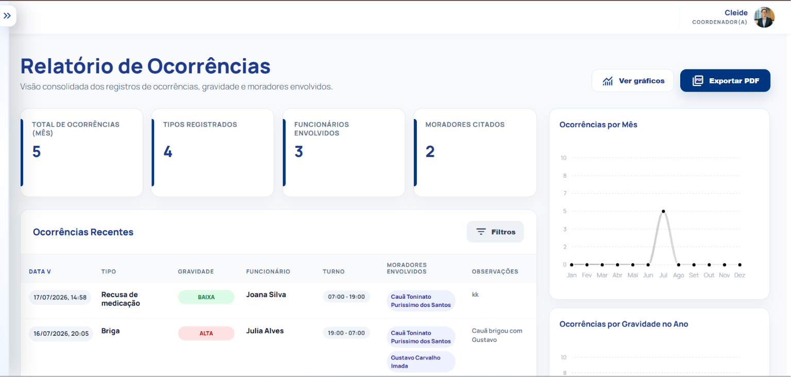
  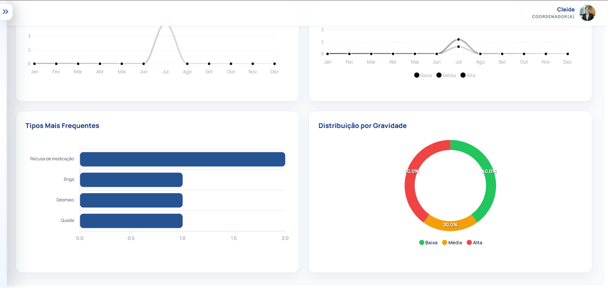

  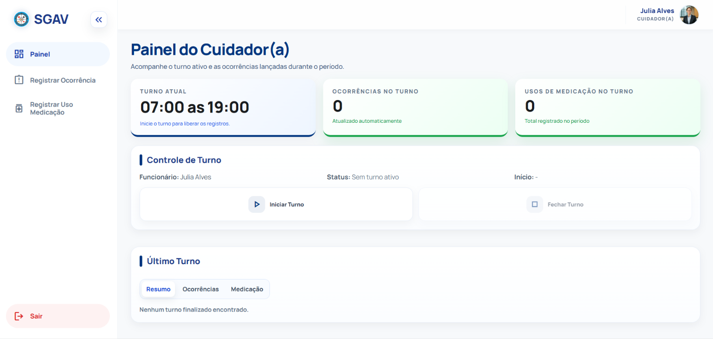

## Highlights

- Public institutional website with news, transparency documents and donation flow.
- Protected administrative area with role-based access for secretary, coordinator and caregiver users.
- Resident, room, employee, activity, donation, expense and medication management.
- Medication box workflow by resident, including dose schedules and caregiver usage records.
- Weekly caregiver schedule templates with reusable models and manual exceptions.
- Coordinator dashboard for shift tracking, occurrences and medication records.
- Reports for donations, expenses, employees and occurrences, with PDF export support.
- Production deployment on Railway with PostgreSQL, persistent uploads and custom domain.
- Continuous deployment from GitHub, with more than 100 commits documenting the product evolution.
- Public discoverability through Google Search Console, XML sitemap, structured data and indexed HTTPS pages.

## User Roles

| Role | Main Responsibilities |
| --- | --- |
| Secretary | Manages residents, employees, rooms, donations, expenses, medicines, medication boxes, activities and news. |
| Coordinator | Manages caregiver schedules, transparency documents, reports and shift supervision. |
| Caregiver | Starts and closes shifts, records occurrences and registers medication usage. |

## Security

The system was prepared with production security in mind:

- Password hashing with **BCrypt**.
- Session-based authentication.
- Role-based access control through custom filters.
- Protected private HTML pages.
- Unauthorized-access screen for blocked routes.
- Environment-based configuration for database and uploads.
- `.env` ignored by Git.
- Safe `.env.example` kept only as a configuration template.
- Prepared statements in critical DAO operations.
- Security headers for production, including CSP, HSTS, `nosniff`, frame protection and referrer policy.

## Tech Stack

| Layer | Technologies |
| --- | --- |
| Backend | Java 21, Spring Boot 4, Spring Web MVC, JDBC |
| Security | Spring Security Crypto, BCrypt, custom servlet filters |
| Database | PostgreSQL |
| Frontend | HTML, CSS, JavaScript, Bootstrap, Tailwind CDN |
| Charts/PDF | ApexCharts, jsPDF |
| Deploy | Railway, Railway PostgreSQL, Registro.br custom domain |
